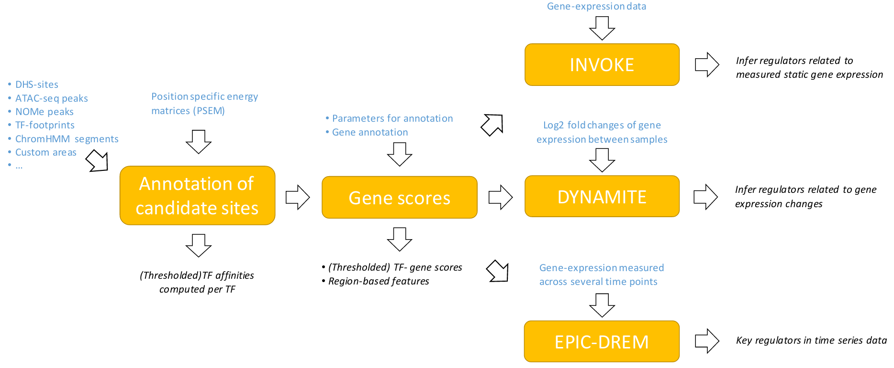

# TEPIC (version 2.2)
-------
TEPIC offers workflows for the prediction and analysis of Transcription Factor (TF) binding sites including:
* TF affinity computation in user provided regions
* Computation of continuous and discrete TF-gene scores 
* Linear regression analysis to infer potential key regulators (INVOKE)
* Logistic regression analysis to suggest regulators related to gene expression differences between samples (DYNAMITE)

A graphical overview on the workflows of TEPIC is shown below. Blue font indicates input, black italic font indicates output.

## News
06.02.2020: Our recently introduced TEPIC-extension supporting regulatory sites from chromatin capture experiments to estimate the influence of enhancers on genome-wide gene expression is now published in [BMC Epigenetics and Chromatin](https://doi.org/10.1186/s13072-020-0327-0).

08.07.2019: We present a novel feature to include TFBS in regulatory sites determined by chromatin conformation capture data. Using an extended feature space representation, the INVOKE model can investigate the regulatory influence of TFs bound to promoters and enhancers separately.

10.10.2018: TEPIC 2.0 is now published in [Bioinformatics](https://doi.org/10.1093/bioinformatics/bty856).

13.08.2018: In addition to the gene-centric annotation, the functionality for transcript based annotation has been added.

21.05.2018: A new collection of TF motifs is included. They are available in the folder [PWMs/2.1](PWMs/2.1).

03.05.2018: INVOKE now supports computing a F-test to judge the importance of individual features.

17.08.2017: TEPIC TF-gene scores can now be binarisied using background regions provided by the user.

21.06.2017: TEPIC TF-gene scores can be binarisied using a TF and tissue specific affinity cut off. This can be combined with the dynamic networks learner [DREM](http://www.sb.cs.cmu.edu/drem/) to build gene regulatory networks that make appropriate use of time-specific epigenetics data. Further details on this new feature are available in the [description](docs/Description.pdf).

13.06.2017: [DYNAMITE](https://github.com/SchulzLab/TEPIC/tree/master/MachineLearningPipelines/DYNAMITE) our workflow for learning differential TF regulation is now included in the repository.

09.06.2017: Version 2.0 of TEPIC is available.
With version 2 of TEPIC, we introduced new features:
* We extended the set of PSEMs.
* TF affinities are computed using a C++ implementation of TRAP.
* Affinities can be normalised by peak length during TF-gene score computation.
* The length of the PSEMs can be considered in the normalisation.
* We introduced features for peak length and peak counts.
* Scaling can be performed in two ways: The original way as proposed in the TEPIC manuscript by directly multiplying
peak signal and TF affinities or by generating a separate signal feature.

Further, the repository now includes the code required to learn linear models from TF gene scores to predict gene expression.
For further details, please see the [INVOKE](https://github.com/SchulzLab/TEPIC/tree/master/MachineLearningPipelines/INVOKE) section.

## Introduction
*TEPIC* offers a variety of workflows to compute and analyse TF binding site (TFBS) predictions. 
The core functionality is the fast and efficient annotation of user provided candidate regions with TF affinities using TRAP (1). 
These predictions are aggregated to TF-gene scores using a window-based assignment strategy.

Within this aggregation TEPIC offers exponential decay (2) and scaling of TF region scores using an epigenetic signal, e.g. the signal of an open chromatin assay.
While computing TF-gene scores, TEPIC can perform normalisation for region length (optionally correcting for the length of the binding motifs as well)
and produces separate features for peak length, peak count and/or peak signal. These features can be used in downstream applications, e.g. to determine
the influence of chromatin accessiblity on gene expression, without considering detailed information on TF binding. 
In addition to the continuous TF-affinities, TEPIC offers a discrete assignment of TFs to genes using a TF-specific affinity threshold derived from random genomic sequences that
show similar characteristics (GC content, length) as compared to the provided regions. 
Further details on the score computation are provided in the [description](docs/Description.pdf). 

*TEPIC* TF-gene scores can be used in several downstream applications to assess the regulatory role of TFs. Three applications are directly supported:
* Using a linear regression analysis to highlight potential key TFs by predicting gene expression within a sample of interest [MachineLearningPipelines/INVOKE](https://github.com/SchulzLab/TEPIC/tree/master/MachineLearningPipelines/INVOKE)
* Suggesting regulators that might be linked to gene-expression differences between samples using a logistic regression classifier [MachineLearningPipelines/DYNAMITE](https://github.com/SchulzLab/TEPIC/tree/master/MachineLearningPipelines/DYNAMITE)
* Generating input for DREM to infer time-point specific transcriptional regulators from temporal epigenetics data [MachineLearningPipelines/EPIC-DREM](https://github.com/SchulzLab/TEPIC/tree/master/MachineLearningPipelines/EPIC-DREM)

Details on the models are provided in the respective subfolders as well as in the [description](docs/Description.pdf).
Here, we provide a brief description on the core funtionality of TEPIC, the computation of TF-gene scores. 

## Installing TEPIC
To run *TEPIC* the following packages/software must be installed:
* Python (minimum version 2.7)
* [bedtools](https://github.com/arq5x/bedtools2): Installation instructions for bedtools can be found [here](http://bedtools.readthedocs.io/en/latest/content/installation.html). Please make sure to add
the bedtools installation to your path.
* A C++ compiler supporting openmp to use the parallel implementation of TRAP.

To compile the C++ version of TRAP and to install possibly missing R-packages for downstream processing execute the script
	[Code/compile_TRAP_install_R_packages.sh](Code/compile_TRAP_install_R_packages.sh).

To use the script [findBackground](Code/findBackground.py), which is necessary to compute TF specific affinity thresholds, the following python libraries are required:
* numpy
* scipy
* twobitreader

## Using TEPIC
To start TEPIC, run the script *TEPIC.sh*, located in the folder *Code*.

    ./TEPIC.sh

The following parameters are required to compute TF affinities in user defined regions:
* -g The reference genome in plain (uncompressed) FASTA format with Ensembl-style chromosome names (i.e., without "chr" prefix). If a "chr" prefix is present, use the -j option. 
* -b Regions the user wants to be annotated; chromosome naming compatible to the reference genome file.
* -o Prefix of the output files.
* -p File containing position specific energy matrices (PSEM) (see next section for details).

To additionally compute TF-gene scores, the argument: 
* -a Genome annotation file (gtf). All genes contained in this file will be annotated. The file must have the original format provided by gencode, gzipped files are not supported. 

needs to be specified.

Additional command arguments are:
* -w Size of the window around the TSS of genes.
* -d Signal of the open chromatin assay in bg format. Used to compute the average per peak signal within the regions specified in -b.
* -e Boolean controlling exponential decay (default TRUE).
* -n Indicates that the file in -b contains the average signal in the peaks in the specified column. In this case the -d option is not required to obtain scaled TF affinities.
* -c Number of cores used within TRAP.
* -f A gtf file containing genes of interest. Only regions contained in the file specified by the -b option that are within the window specified by the -w option around these genes will be annotated. The file must have the original format provided by gencode, gzipped files are not supported.
* -y Flag indicating whether the entire gene body should be annotated with TF affinities. A window of half the size of the -w option will be additionaly considered upstream of the genes TSS.
* -l Flag to be set if affinities should not be normalised by peak length.
* -u Flag to be set if peak features for peak length and peak counts should not be generated.
* -q Parameter to be set if only peak features should be generated (default FALSE).
* -x If -d or -n is used together with this flag, the original (Decay-)Scaling formulation of TEPIC is used to compute gene-TF scores.
* -m Path to a tab delimited file containing the length of the used PSEMs. This is incorporated in normalising peak length.
* -z Flag indicating that the output of TEPIC should be zipped.
* -k Path to a file containing background regions provided by the user. This option can not be used together with the -r option. 
* -r Path to a 2bit representation of the reference genome. This is required to compute a TF specific affinity threshold as well as a binary and sparse TF-gene interaction list. This can not be used together with the -k option. 
* -v p-value cut off used to determine a cut off to derive a binary score for TF binding (default 0.05).
* -i minutes that should be spend at most per chromosome to find matching random regions (default 3).
* -j Flag indicating that the reference genome contains a chr prefix. 
* -t Flag indicating that the annotation should be based on transcripts, not on genes.
* -h Loop file containing chromatin contacts. Only intrachromosomal contacts are supported.
* -s Loop window used to link a gene to a chromatin loop (default 5000).

## Output 
Depending on the used arguments, TEPIC produces files containing:
* TF affinities for all user specified regions (*Prefix_Affinity.txt*). These files are always generated.
* Scaled TF affinities for all user specified regions (*Prefix_Scaled_Affinity.txt*). This is only generated if the -d or -n option is used together with the -x option.
* A file containing the factors used to scale the original TF affinities (*Prefix_Peak_Coverage.txt*). This is only generated if the -d or -n option is used together with the -x option.
* TF affinities along with features for peak length, peak counts and/or the average signal within a peak (*Prefix_Affinity_Gene_View.txt*). This is only generated if the -a option is specified.
* Thresholded TF affinities (*Prefix_Thresholded_Affinities.txt*). These scores are computed if the -r or -k option is used.
* Thresholded TF affinity gene-scores (*Prefix_Thresholded_Affinity_Gene_Scores.txt*). This file is generated if the -r or -k option is used together with the -a option. 
* A sparse representation that contains only those TF-gene interactions with affinities above an affinity threshold derived from random genomic sequences (*Prefix_Thresholded_Sparse_Affinity_Gene_View.txt*). This file is generated if the -r or -k option is used together with the -a option.

The *Prefix_Affinity.txt* files are tab separated files listing the genomic coordinates of candiate regions in the first column and TF affinities in the following columns:

	Genomic Position	TF1	TF2	...	TFn
	chr1:2321-2340		0.4	0.2	...	4.2

The *Prefix_Affinity_Gene_View.txt* files are tab separated files listing the Ensemble GeneID in the first column, TF gene-scores in the following columns and features on peak-length, peak-count, and peak-signal if computed.

	GENEID		TF1	TF2	...	TFn	peak length	peak count	peak signal
	ENSG00000044612	0.4	0.2	...	4.2	23		3		19.2

The *Prefix_Peak_Coverage.txt* files are tab separated files listing the genomic coordinates in the first column and the scaling value in the next column.

	Genomic Position	Factor
	chr1:2321-2340	0.4

The *Prefix_Thresholded_Affinities.txt* files are tab separated files listing the genomic coordinates in the first column and TF affinities in the following columns. Scores below the computed TF-specific threshold are set to zero.

	Genomic Position		TF1	TF2	...	TFn
	chr1:2321-2340		0	0	...	4.2

The *Prefix_Thresholded_Affinity_Gene_View.txt* files are tab separated files listing the Ensemble GeneID in the first column, TF gene-scores in the following columns and features on peak-length, peak-count, and peak-signal if computed.
Here, thresholded TF affinities are used for the computation.

	GENEID		TF1	TF2	...	TFn	peak length	peak count	peak signal
	ENSG00000044612	0	0	...	4.2	23		3		19.2

The *Prefix_Conformation_Data_Affinity_Three_Peak_Based_Features_Gene_View.txt* files are based on the previous structure but extend it by including the same features, that is TF gene-scores and peak features determined for DHS residing in chromatin loops:

	GENEID		TF1	TF2	...	TFn	peak length	peak count	peak signal	LR_TF1	...	LR_TFn	LR_peak length	LR_peak count	LR_peak signal
	ENSG00000044612	0	0	...	4.2	23		3		19.2		3.4	...	0.9	14	4	63.3

The *Prefix_Thresholded_Sparse_Affinity_Gene_View.txt* files are tab separated files listing the Ensemble GeneID in the first column, and the name of the TF associated to this gene in the second column.
Here, thresholded TF affinities are used for the computation. The third column of this file is required by DREM and does not carry any specific meaning.

	GENEID		TF Name	Score
	ENSG00000044612	CTCF	1

Further details on the output are provided in the [description](docs/Description.pdf).

Each run of TEPIC generates an *analysis meta datafile (amd)* containing all parameters, files, and outputs associated with the last run of TEPIC.
Together with the provided process xml file, the executed command lines  can be reconstructed (3). We provide *amd* files in the folder
*MetaData*. These correspond to the gene scores of the *50kb* and *50kb-S* annotation introduced in the *TEPIC* manuscript.

Note that the input files **have to** have unix file endings. Using bed graph files to compute the signal in peaks is currently only supported for homo sapiens, mus musculus, and rattus norvegicus.

## Example
To run a trial case of *TEPIC* to compute TF-gene scores, you can use the data provided in the *Test* folder and use the command

	./TEPIC.sh -g ../Test/example_sequence.fa -b ../Test/example_regions.bed -o TEPIC-Example -p ../PWMs/1.0/pwm_vertebrates_jaspar_uniprobe_original.PSEM -a ../Test/example_annotation.gtf -w 3000 -e FALSE

This will generate TF-gene scores for the genes contained in *example_annotation.gtf*, using a window of size 3000bp, all pwms contained in *pwm_vertebrates_jaspar_uniprobe_converted.PSEM*, and without exponential decay. 

Additionally, we provide a script to test several annotation versions of TEPIC. Execute the script

	bash runTestCases.sh

to compute multiple trial cases. The script can be found in the folder *Test*.

## Position specific energy matrices
There are three folders containing Position specific energy matrices (PSEMs):
Our current collection of PSEMs, containing matrices from *JASPAR* (4), *HOCOMOCO* (5), and the *Kellis ENCODE Motif database* (6), is stored in the folder [PWMs/2.1](PWMs/2.1).
The previously used motifs are provided in the folders [PWMs/2.0](PWMs/2.0) and [PWMs/1.0](PWMs/1.0).
The position weight matrices used in the *TEPIC* manuscript are stored in the file
	[PWMs/1.0/pwm_vertebrates_jaspar_uniprobe_original.PSEM](PWMs/1.0/pwm_vertebrates_jaspar_uniprobe_original.PSEM).

In detail, the current collection contains from the JASPAR 2018 Core database:
* 579 PSEMs for vertebrates
* 176 PSEMs for fungi
* 26 PSEMs for nematodes
* 489 PSEMs for plants 
* 1 PSEM for urochordates
* 133 PSEMs for insects

Additionally, we provide species specific collections of JASPAR matrices:
* 3 PSEMs for Antirrhinum majus
* 5 PSEMs for Arabidopsis lyrata
* 440 PSEMs for Arabidopsis thaliana
* 22 PSEMs for Caenorhabditis elegans
* 132 PSEMs for Drosophila melanogaster
* 1 PSEMs for Fragaria x ananassa
* 7 PSEMs for Gallus gallus
* 6 PSEMs for Glycine max
* 1 PSEM for Halocynthia roretzi
* 459 PSEMs for Homo sapiens
* 1 PSEM for Hordeum vulgare
* 1 PSEM for Medicago truncatula
* 1 PSEM for Meleagris gallopavo
* 157 PSEMs for Mus musculus
* 1 PSEM for Neurospora crassa
* 1 PSEM for Nicotiana
* 4 PSEMs for Orcytolagus
* 7 PSEMs for Oryza sativa
* 1 PSEM for Petunia x hybrida
* 1 PSEM for Phaeodactylum tricornutum
* 9 PSEMs for Physcomitrella patens
* 3 PSEMs for Pisum sativum
* 1 PSEM for Populus trichocarpa
* 2 PSEMs for Rattus norvegicus
* 2 PSEMs for Rattus rattus
* 176 PSEMs for Saccaromyces cerevisiae
* 2 PSEMs for Solanum lycopersicum
* 1 PSEM for Triticum aestivum
* 4 PSEMs for Xenopus laevis
* 8 PSEMs for Zea mays

All JASPAR matrices can be found in [PWMs/2.1/JASPAR_PSEMs](PWMs/2.1/JASPAR_PSEMs)

From HOCOMOCO we provide 402 motifs for homo sapiens and 358 for mus musculus, available in [PWMs/2.1/HOCOMOCO_PSEMs](PWMs/2.1/HOCOMOCO_PSEMs)

The Kellis set contains 58 motifs, stored in  [PWMs/2.1/Kellis_PSEMs](PWMs/2.1/Kellis_PSEMs).

Additionally we provide non-redundant collections for homo sapiens and mus musculus considering motifs from all three sources:
* 561 PSEMS for homo sapiens
* 380 PSEMs for mus musculus

The matrices are stored in the folder [PWMs/2.1/Merged_PSEMs](PWMs/2.1/Merged_PSEMs).

Furthermore, we used a motif clustering approach (7), to merge similar motifs of the files containing matrices from all three sources. This led to
* 483 PSEMs for homo sapiens
* 306 PSEMs for mus musculus

The matrices are stored in the folder [PWMs/2.1/Clustered_PSEMs](PWMs/2.1/Clustered_PSEMs).

Files holding the length of the PSEMs are provided too. 

Additional position weight matrices can be transformed to a usable format using 
	[Code/PSCM_to_PSEM.cpp](Code/PSCM_to_PSEM.cpp).
This program converts matrices in TRANSFAC format to the energy format used by TRAP. 
Details on the parameters used for conversion can be found in the header of the provided files.
Note that the character after the P in TRANSFAC format needs to be a zero.

In TRANSFAC format, a matrix has to have the following structure:

	XX
	
	ID \<RunningNumber\> \<TF-Name\>
		
	XX
	
	P0        A         C         G         T
	
	1         0         93        6         1
	
	2         7         81        1         12
	
	.
	
	.
	
	.
	
	14        1         3         95        0
	
	XX
	
	//   

In the PSEM format, a matrix has to be in the following structure:

	\> \<RunningNumber\> \<TF-Name\>	lnR0: \<value\>
		
	1.56945   -0.108976 1.46047   0
	
	5.06003   4.54008   0         4.06982
	
	.
	
	.
	
	.
	
	4.59839   4.0784   4.07844   0
	
	5.11834   4.59839   0         5.11834
	

## Acknowledgments
We thank Helge Roider for providing the C++ implementation of TRAP, which we slightly modified for running in parallel.
TEPIC 2.0 has been funded by the Bundesministerium für Bildung und Forschung (BMBF) with project number 01DP17005 under the acronym EPIREG.

## Citation
If you are using TEPIC and/or [INVOKE](https://github.com/SchulzLab/TEPIC/tree/master/MachineLearningPipelines/INVOKE) please cite:

**Combining transcription factor binding affinities with open-chromatin data for accurate gene expression prediction**
Schmidt et al., Nucleic Acids Research 2016; doi: 10.1093/nar/gkw1061 [full text](http://nar.oxfordjournals.org/content/early/2016/11/29/nar.gkw1061.full) 

If you are using [DYNAMITE](https://github.com/SchulzLab/TEPIC/tree/master/MachineLearningPipelines/DYNAMITE) please also cite:

**Epigenomic Profiling of Human CD4+ T Cells Supports a Linear Differentiation Model and Highlights Molecular Regulators of Memory Development**
Durek et al. Cell Immunity, Volume 45, Issue 5, 15 November 2016, [full text](http://www.cell.com/immunity/fulltext/S1074-7613(16)30433-2)

You may also consider to cite our latest publication describing the TEPIC 2.0 release ... :

**TEPIC 2 - An extended framework for transcription factor binding prediction and integrative epigenomic analysis**
Schmidt et al., Bioinformatics 2018; doi: 10.1093/bioinformatics/bty856 [full text](https://doi.org/10.1093/bioinformatics/bty856)

... and its extensions:

**Integrative prediction of gene expression with chromatin accessibility and conformation data**
Schmidt et al., Epigenetics & Chromatin 2020; doi: 10.1186/s13072-020-0327-0 [full text](https://doi.org/10.1186/s13072-020-0327-0)

Other works that have influenced ours:
> (1) Predicting transcription factor affinities to DNA from a biophysical model, Roider HG, et al., Bioinformatics, 2007.

> (2) ChIP-Seq of transcription factors predicts absolute and differential gene expression in embryonic stem cells, Ouyang Z, et al.,  PNAS, 2009.

> (3) A general concept for consistent documentation of computational analyses, Ebert P, et al.,  Database, 2015.

> (4) JASPAR: an open-access database for eukaryotic transcription factor binding profiles, Sandelin A., et al., Nucleic Acids Research, 2004.
 
> (5) HOCOMOCO: a comprehensive collection of human transcription factor binding sites models , Kulakovskiy Ivan V., et al., Nucleic Acids Research, 2013.

> (6) Systematic discovery and characterization of regulatory motifs in ENCODE TF binding experiments, Kheradpour P, and Kellis M, Nucleic Acids Research, 2013.

> (7) Natural similarity measures between position frequency matrices with an application to clustering, Pape U.J., et al., Bioinformatics, 2008.
